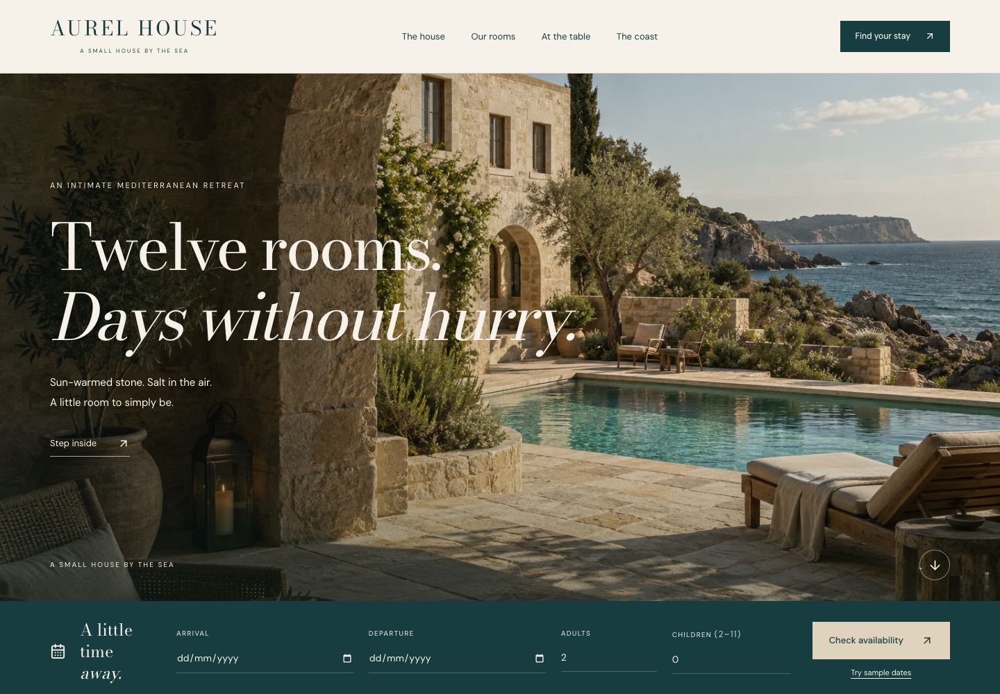

# AUREL HOUSE

**A small house by the sea.** A fictional twelve-room Mediterranean boutique hotel and a complete browser-only booking demonstration, built as an agency portfolio project.

Private source repository: [zakariyarjabbar/aurel-house](https://github.com/zakariyarjabbar/aurel-house), branch `main`. The repository contains application source, optimized assets, tests, documentation and screenshot evidence. Dependencies, local build output, temporary test data and environment files are excluded. Website deployment is a separate step.

**Portfolio demonstration. Reservations are saved in this browser only. No payment is taken and no room is reserved.** The name, setting, guest records and offerings are fictional concepts. No trademark clearance, domain ownership or real operator is claimed.



[Full desktop homepage](docs/screenshots/home-desktop.png) · [Mobile homepage](docs/screenshots/home-mobile.png) · [Booking review](docs/screenshots/booking-mobile.png) · [Confirmation](docs/screenshots/confirmation-desktop.png)

## Run locally

Node.js 22.9+ or a compatible supported newer version, npm. Developed and verified with Node 26.0.0. **No database, service keys or accounts are required.**

```sh
npm ci
npm run dev
```

Development: `http://127.0.0.1:3000`.

```sh
npm run typecheck
npm run lint
npm test
npm run build
npm run start
```

The production static preview is **http://127.0.0.1:3001** and serves `out/`, including nested routes and a genuine 404. `next start` is intentionally not used. Choose another static port with `AUREL_PORT=3002 npm run start`.

With Google Chrome installed and the static preview running:

```sh
npm run test:browser
node scripts/layout-check.mjs
```

The browser suite uses isolated profiles and a fixed test clock; it never touches your ordinary browser data. The supplementary layout script checks long edited room names and enlarged text. Override the origin with `AUREL_PREVIEW_URL=http://127.0.0.1:3002 npm run test:browser`. Actual evidence and results are in [docs/QA.md](docs/QA.md) and `docs/browser-results.json`.

Verified: 29 domain/storage tests, 16 browser scenarios, all 26 exported routes, eight layout stress checks and eight axe surfaces with zero detected violations. Typecheck, lint and production build pass. The independent visual reviewer closed both final findings. These checks do not establish WCAG conformance or cross-browser certification. Cold mobile booking LCP measured 4.256 seconds under the documented throttle; see QA for full measurements and limits.

## Explore

1. Open `/demo/` and choose **Try a sample stay**. Dates are found from actual free physical units in the current local state.
2. Compare rooms, choose optional extras, and use **Use sample guest**. The review shows every occupied night, extras and total.
3. Open the discreet demo payment control. **Decline** preserves the draft without consuming inventory; **Success** saves a reservation and local message preview. No card fields exist.
4. From confirmation, print an A4 artifact, download an all-day calendar file, or manage the stay. Eligible future confirmed stays can be amended after accepting the price difference, or cancelled for a full simulated refund.
5. Open `/admin/`. Find the same reservation, inspect unit availability, change local room details/rates, create conflict-checked maintenance, and inspect inquiries and confirmation-message previews.
6. Use `/demo/` to download local data or reset only this application’s records. Reset requires confirmation.

## Implemented scope

- Full editorial storefront: homepage, four room details and comparison index, house, dining/sample menu, three experiences, three complete journal articles, filtered/lightbox gallery, contact, FAQ, policies and genuine 404.
- Twenty-three coherent generated photographs, locally optimized responsive WebP assets, original emblem and illustrative location map, locally served Bodoni Moda/DM Sans, noindex metadata and a social-preview card.
- Twelve physical units, once-seeded relative reservations/maintenance, persistent draft, continuous-room availability, integer-cent nightly pricing, opt-in extras and fictional guest form.
- Idempotent simulated confirmation, decline/retry, accepted quote/policy snapshots, locally stored messages, confirmation/print/calendar, future amendments and cancellations.
- Open front desk with daily arrivals/departures/occupancy, searchable reservations, unit calendar and mobile list, valid status transitions, room edits, maintenance, inquiries and activity.
- Validated versioned storage, hydration, same-origin tab synchronization, scoped reset, preserved corrupt data and explicit temporary-session fallback.

## Rules and prices

| Room | Units | Capacity | Area | Base USD/night |
|---|---|---|---|---|
| Courtyard Room | C01–C04 | 2 | 24 m² | $190 |
| Terrace Room | T01–T04 | 2 | 30 m² | $250 |
| Sea Studio | S01–S02 | 3 | 38 m² | $340 |
| Aurel Suite | A01–A02 | 4 | 52 m² | $420 |

One reservation books one room for 1–14 nights. At least one adult; children ages 2–11. Arrival may be today through day 365, departure no later than day 366. Europe/Athens is the explicit fictional hotel timezone. Occupied nights use `[arrival, departure)`, so adjacent stays work across DST and month/year boundaries. Check-in is from 15:00, checkout by 11:00; simulated late checkout is until 14:00.

Friday/Saturday nights multiply base rate by 1.15; June–August by 1.20. Both multiply before one nightly rounding to cents. Breakfast is $18/adult/night and $9/child/night, transfer $65/stay, late checkout $40/stay. No extras are automatic. Prices include fictional taxes/fees; this is not real tax guidance. The accepted quote remains unchanged by subsequent local rate edits. Cancellation is available before arrival day for future confirmed bookings; on arrival day or after check-in use a local inquiry. Refunds and amendment differences are simulated.

## Storage and privacy

The centralized store persists `aurel-house:demo:v1` with schemaVersion, revision, seedAnchor, draft, reservations, roomOverrides, maintenance, inquiries, messages and activity. Fixtures seed only after hydration establishes that there is no existing state. Old/unknown schemas are preserved and need an explicit scoped reset. A save failure never claims durable success; the user may explicitly enable temporary-session mode, whose changes disappear on reload. Recovery downloads preserve corrupt source text where possible.

Same-origin tabs in the same browser profile share state. Other devices, browsers, origins and private contexts do not provide shared reservations. Clearing site data removes records. Browser storage is user-editable and is not secure authentication or authorization. LocalStorage cannot guarantee atomic booking across tabs. This is intentional frontend scope, not a production reservation system. Use fictional guest details; there is no analytics, outbound form submission, email delivery, payment data, password or identity-document collection.

## Static hosting

Upload the **contents of `out/`** to a static host that serves directory `index.html` files and `404.html` for missing routes. All ten known content slugs are generated at build time; runtime references use fixed paths with query parameters. Do not add an SPA fallback that returns the homepage for missing routes. Use HTTPS when hosting; secure-context browser APIs are supported on localhost during development.

Before an authorized deployment, optionally build with `NEXT_PUBLIC_SITE_URL=https://your-authorized-host.example npm run build` to set the public canonical/social origin. The default is `http://localhost:3001`; no origin or credential is needed to run locally. Keep `noindex` because this is a fictional commercial concept. **No external publishing has been performed.**

## Assets and supporting documents

Generated images use reference-driven prompts to maintain one fictional property. Exact prompts, hashes, references, alt/caption notes and inspection records are in `assets/source/manifest.json`; usage and licensing details are in [docs/ASSETS.md](docs/ASSETS.md). All shipping rasters have adjacent provenance sidecars. Sources are 1536×1024, optimized into three widths. The native hero is not 4K. Font licenses ship in `public/fonts/`; Lucide icons use ISC licensing.

`npm run assets` is an optional authoring command that reads PNG/JPEG sources from `/private/tmp/aurel-assets` by default; shipped WebP files require no regeneration. Run `node scripts/prepare-assets.mjs /path/to/sources` then `node scripts/provenance.mjs` if replacing assets. The original social composition can be refreshed with `node scripts/social-image.mjs` while the static preview runs, followed by `npm run build`.

- [PRODUCT.md](PRODUCT.md): catalog, scope and acceptance.
- [DESIGN.md](DESIGN.md): final visual system and responsive behavior.
- [docs/ARCHITECTURE.md](docs/ARCHITECTURE.md): state flow and domain rules.
- [docs/QA.md](docs/QA.md): actual checks, screenshots, performance and limitations.
- [docs/CASE_STUDY.md](docs/CASE_STUDY.md): factual portfolio draft.
- [docs/STATUS.md](docs/STATUS.md): continuation status.

The production version of an actual hotel would need verified business content, legal/privacy review, secure shared reservation infrastructure, operational integrations and real payment handling. None of those are implemented or appropriate additions to this browser-only demonstration.
